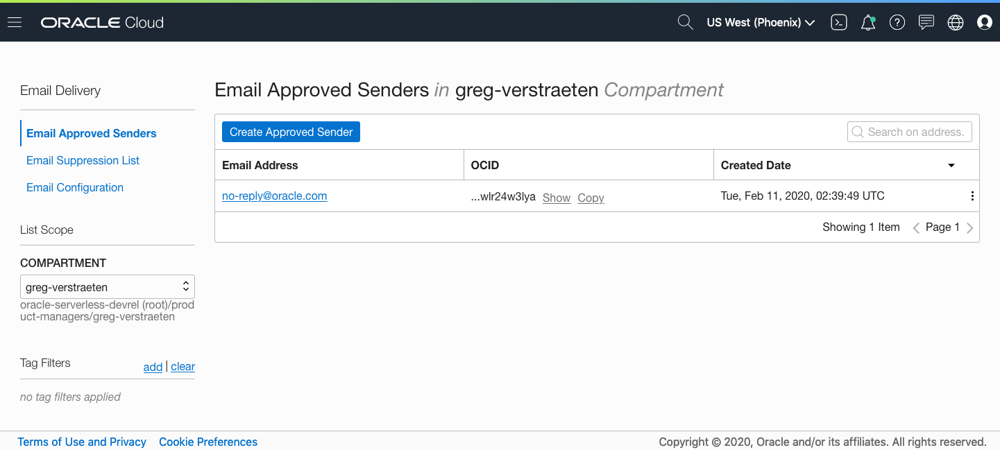
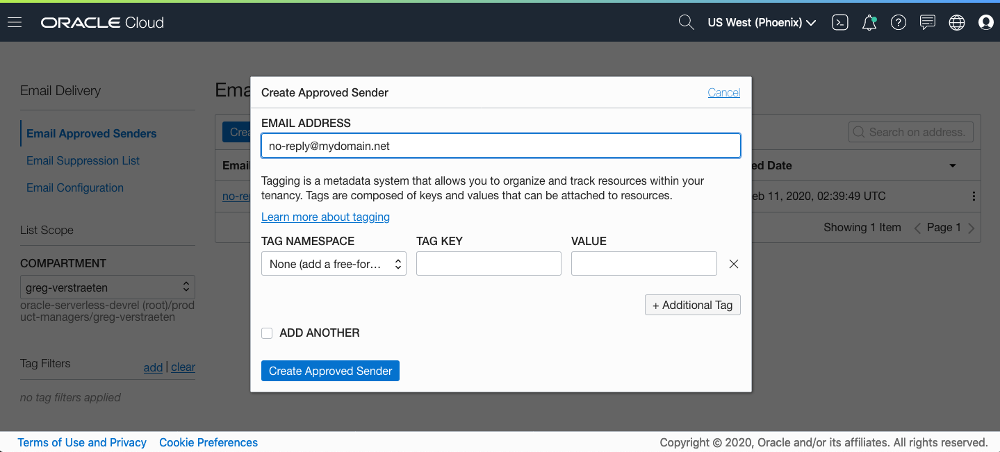

# Function that sends an email using OCI Email Delivery
This function sends an email using the OCI Email Delivery Service.

As you make your way through this tutorial, look out for this icon .
Whenever you see it, it's time for you to perform an action.


## Prerequisites
Before you deploy this sample function, make sure you have run step A, B and C of the [Oracle Functions Quick Start Guide for Cloud Shell](https://www.oracle.com/webfolder/technetwork/tutorials/infographics/oci_functions_cloudshell_quickview/functions_quickview_top/functions_quickview/index.html)
* A - Set up your tenancy
* B - Create application
* C - Set up your Cloud Shell dev environment


## List Applications 
Assuming your have successfully completed the prerequisites, you should see your 
application in the list of applications.
```
fn ls apps
```


## Review and customize the function
Review the following files in the current folder:
* the code of the function, [func.py](./func.py)
* its dependencies, [requirements.txt](./requirements.txt)
* the function metadata, [func.yaml](./func.yaml)


## Deploy the function
In Cloud Shell, run the *fn deploy* command to build the function and its dependencies as a Docker image, 
push the image to OCIR, and deploy the function to Oracle Functions in your application.


```
fn -v deploy --app <app-name>
```


## Configure the Email Delivery Service


On the OCI console, navigate to *Email Delivery*. Click `Create Approved Sender`.


Enter the email address of the approved sender and click `Create Approved Sender`.



The creation of the *Approved Sender* takes several minutes.

Navigate to *Email Delivery* > *Email Configuration* and write down the SMTP server name.
Click `Manage SMTP Credentials` which takes you to your *User Details*, click on `Generate SMTP Credentials` and enter a description. Your SMTP Username and password will be displayed, write them down, you will need them to configure the function.


## Set the function configuration values
The function requires the following configuration values to be set:
- smtp-username
- smtp-password
- smtp-host
- smtp-port (25 or 587)


Use the *fn CLI* to set the config value:
```
fn config function <app-name> <function-name> smtp-username <SMTP-username>
fn config function <app-name> <function-name> smtp-password <SMTP-password>
fn config function <app-name> <function-name> smtp-host <SMTP-Server-name>
fn config function <app-name> <function-name> smtp-port <SMTP-Port>
```
e.g.
```
fn config function myapp oci-email-send-python  smtp-username  "ocid1.user.oc1..aaaaaaaause3s2zw3kn3qvxxc5c5ouc4pu6byfxiuplncjkzzxinijhmqj5q@ocid1.tenancy.oc1..aaaaaaaaydrjm77otncda2xn7qtv7l3hqnd3zxn2u6siwdhniibwfv4wwhta.7g.com"
fn config function myapp oci-email-send-python  smtp-password  '{$M$mWmvlN&P#o>!14F8'
fn config function myapp oci-email-send-python  smtp-host  "smtp.us-phoenix-1.oraclecloud.com"
fn config function myapp oci-email-send-python  smtp-port  587
```


## Invoke the function
The function requires the following keys in the payload to be invoked:
- sender-email
- sender-name
- recipient
- subject
- body


```
echo '{ "sender-email":"<approved-sender-email>", "sender-name":"<sender-name>", "recipient":"<recipient-email>",
"subject":"<email-subject>", "body":"<email-body>" }' | fn invoke <app-name> oci-email-send-python
```
e.g.:
```
echo '{ "sender-email":"no-reply@oracle.com", "sender-name":"Test", "recipient":"gregory.verstraeten@oracle.com",
"subject":"Hello!", "body":"This is a test email" }' | fn invoke myapp oci-email-send-python
```

Upon success, the function will return "Email successfully sent!" and the recipient will receive an email.


